# Rescala
An online practice diary for classical musicians, built with Django.
> Get closer to your musical goals with Rescala.
>
> Rehearse. Record. Repeat.

This project was designed and built as the developer's 4th milestone project for Code Institutes' Diploma in Full Stack Software Development.

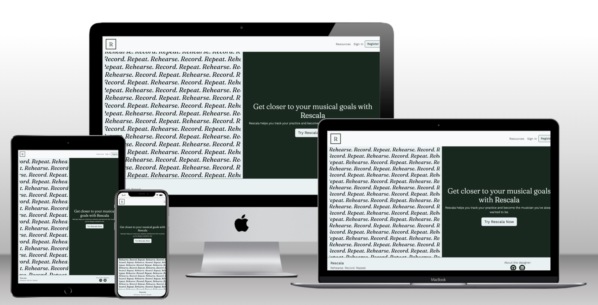

Key features:

 - Log and review practice sessions, including date, duration, your areas of focus and personal reflections
 - Set and track long-term goals
 - View insights from your practice on a bespoke dashboard
 - Read and save articles focused on intentional practice, habit-building and personal development

 ## Live Project
[The deployed site is available here.](https://denham-rescala.herokuapp.com/ "Link to open deployed website")

## Contents

  * [User Stories](#user-stories)
  * [Design](#design)
    + [Wireframes](#wireframes)
    + [Colour Scheme](#colour-scheme)
    + [Typography](#typography)
  * [Database Model](#database-model)
    + [Requirements](#requirements)
    + [Models](#models)
  * [Current Features](#current-features)
    + [Layout Features](#layout-features)
    + [Landing Page](#landing-page)
    + [Authentication](#authentication)
    + [Dashboard](#dashboard)
    + [Resources](#resources)
    + [Individual Resource](#individual-resource)
    + [Log Practice](#log-practice)
    + [Session Details](#session-details)
    + [Edit Practice](#edit-practice)
    + [Resource Admin](#resource-admin)
    + [404 Page](#404-page)
  * [Planned Features and Improvements](#planned-features-and-improvements)
  * [Testing](#testing)
  * [Deployment](#deployment)
  * [Technologies](#technologies)
    + [Languages](#languages)
    + [Libraries and Frameworks](#libraries-and-frameworks)
    + [Hosting and Storage](#hosting-and-storage)
    + [Version Control](#version-control)
    + [Design & Media](#design---media)
    + [Databases](#databases)
  * [Credits](#credits)
    + [Code](#code)
    + [ChatGPT](#chatgpt)
    + [Music Resources](#music-resources)
  * [Acknowledgements](#acknowledgements)

## User Stories

Rescala is designed for serious music students and young professionals who want to make their practice more focused and intentional and gain greater insights into their progress and development. The three imagined profiles, below, were useful in developing the project's design, functionality and scope.

**User 1**
- 17 years old
- Studying music at A-level and preparing for auditions for universities and conservatoires.
- Studies most days, for an hour

**User 2**
- 21 years old
- Studying at a Conservatoire or other specialist performing arts institution
- Practices every day, for up to 3 hours

**User 3**
- 25 years old
- Young professional, preparing for multiple performances and projects
- Practices every day, for up to 4 hours

For all users, the key benefits of using Rescala would be to encourage meaningful self-reflection and to aggregate and visualize insights from recorded practice.

The User Stories for this project were planned and tracked  using [GitHub's Projects Tool.](https://docs.github.com/en/issues/planning-and-tracking-with-projects/learning-about-projects/about-projects "Link to information on GitHub Projects")

User Stories were categorised into Epics and broken down into tasks with clear acceptance criteria. The user stories can be viewed, in full, [here.](https://github.com/users/denham-ed/projects/6 "Link to Rescala User Stories")

Inspired by the Agile methodology and utilising the MoSCoW prioritization, these user stories were assigned to short sprints, as documented on the Projects board. This process allowed for incremental development through iteration.

## Design 
### Wireframes
The layout for Rescala was developed using [Balsamiq](https://balsamiq.com/ "Link to Balsamiq")

The wireframes for Rescala can be found [here.](documentation/diagrams/wireframes.pdf)

### Colour Scheme
Rescala uses the following colours throughout.

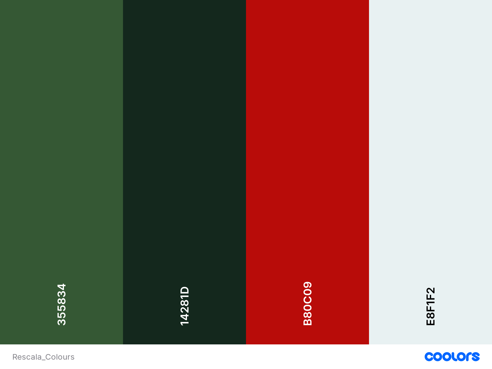

Dark Green and Alice Blue are used as alternatives for black and white. The red is used for error messages and to highlight key information on forms and widgets. The lighter green is used primarily for shading and to add additional contrasts.

All four colours are used with varying degrees of opacity to support text/image overlays.
### Typography
Two fonts are used in the application.

**Fraunces** is used for headings and the brand logo in the header. It is used with a font-weight of 300.

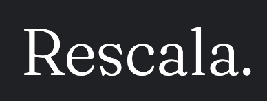

**Work Sans** is used with a font-weight of 300 for the majority of the text in the body. Occasionally it appears at 400, to add emphasis for subtitles and for headers.

## Database Model

### Requirements 
- Each user needs a list of goals. These are unique to the user.
- Each user needs a list of resources. This is a many-to-many relationship.

Therefore, the profile model for this application extends the Django User model.

### Models
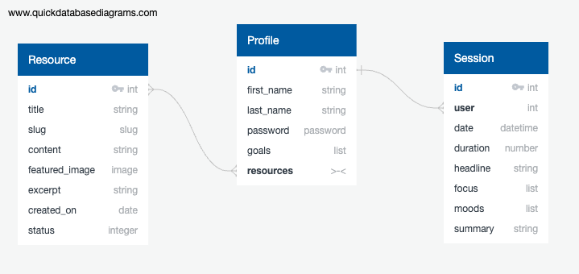

## Current Features 

### Layout Features

**Header**

- Appears on every page
- Features the Brand logo in the top left. This acts as a link to the Landing Page / Dashboard.

- Includes a navigation bar with links to key areas

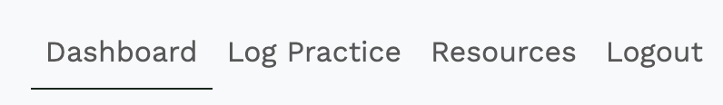

- Authenticated users can access the Dashboard, Log Practice and Log Out areas
- Current page is shown to the user
- Anonymous users will only have access to the Resources link

**Footer**

- Appears on every page
- Includes the brand name and slogan

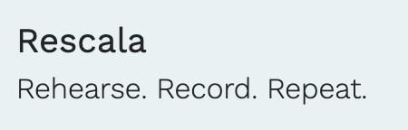

- Includes links to the developer's GitHub and LinkedIn page. These open in a new browser tab.

### Landing Page

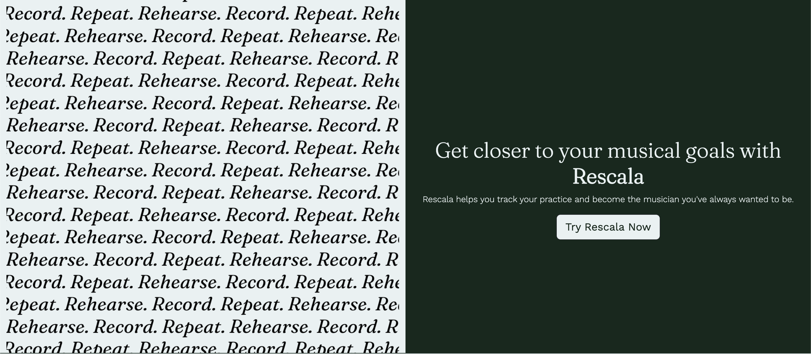

- Displays the brand's slogan
- Features a large Call-To-Action button
- Authenticated users are redirected to the Dashboard page

### Authentication

The authentication for Rescala is handled by [Django AllAuth.](https://django-allauth.readthedocs.io/en/latest/)

Anonymous (unauthenticated users) can view the landing, sign in and register pages, as well as access the Resources section of the site.

The following pages extend and modify the AllAuth templates, adding custom formatting and error messages.
**Register Page**

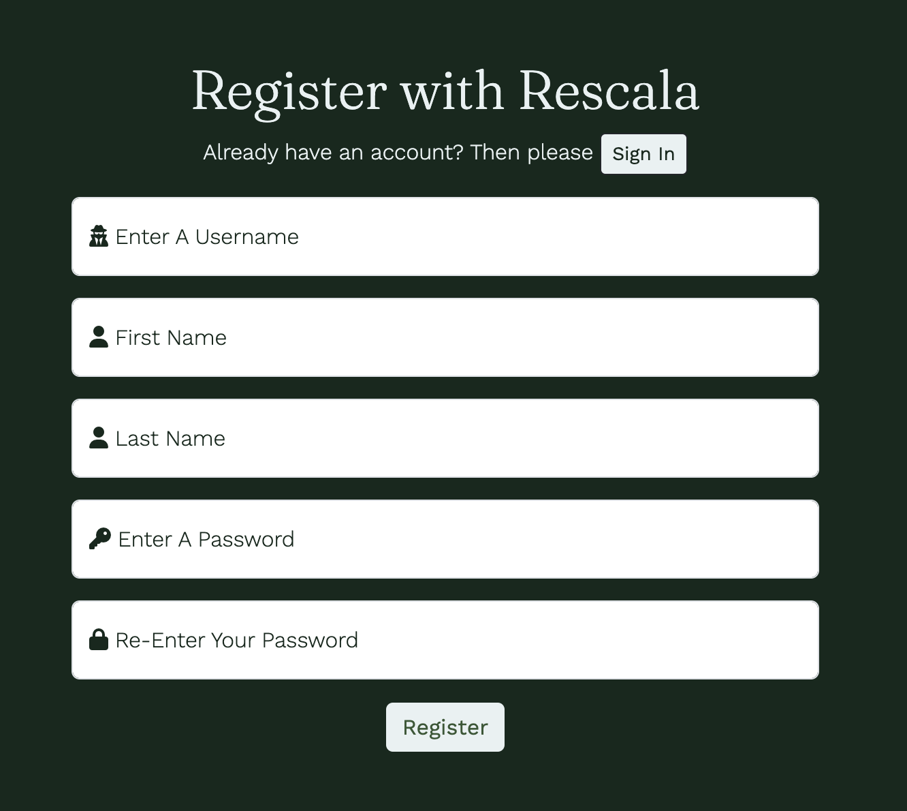

- New users can register for a Rescala account
- Floating labels provide clear instructions to the user
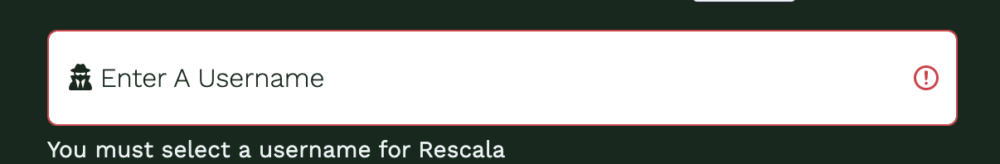

- Registered users are guided to the sign-in page
- Invalid form submissions are indicated with custom error messages

**Sign In Page**

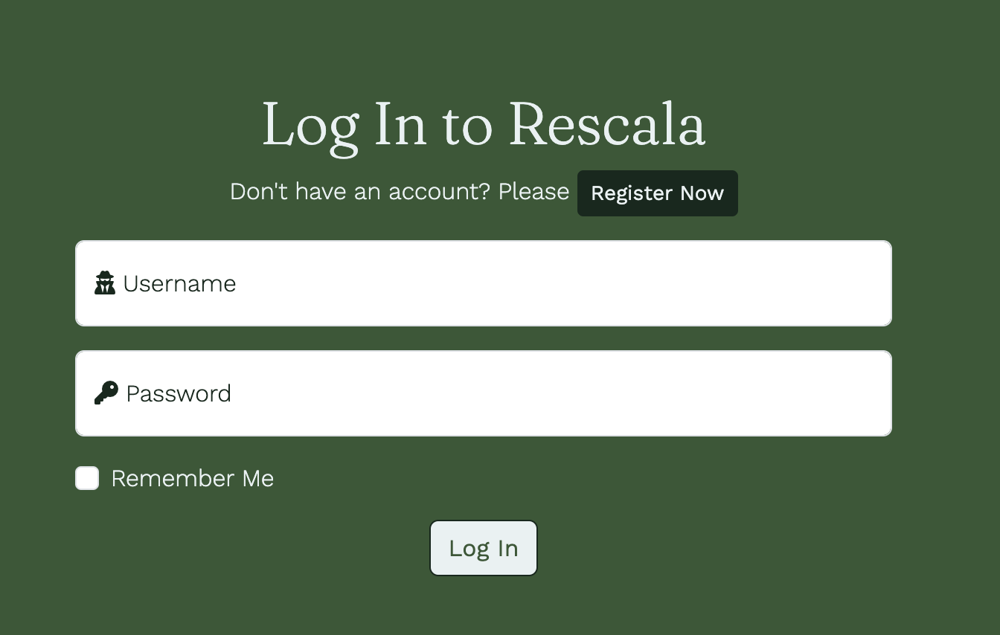
- Users with accounts can sign in to Rescala
- Floating labels provide clear instructions to the user
- New users are guided to the Register page
- Valid submission redirects to the Dashboard
- Invalid form submissions are indicated with custom error messages
- Users can opt for the Remember Me option to bypass this stage next time

**Sign Out Page**

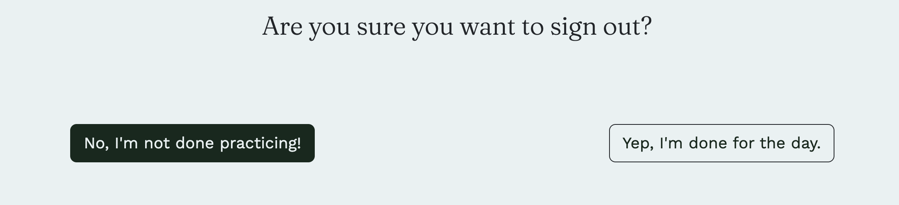

 - Users are asked to confirm that they are logging out
 - The confirmation options are in keeping with the tone of the target user

### Dashboard

The dashboard allows a logged-in user to view aggregated statistics about their logged practices. It also serves as the landing page for authenticated users.

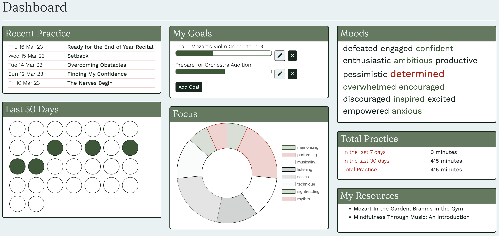

The responsive layout of the Dashboard widgets is achieved using [MasonryJS](https://masonry.desandro.com/ 'Link to MasonryJS')

**Recent Practices**
- The most recent 5 logged practice sessions are rendered with the date and the headline.
- Each session is clickable and redirects to the [Session Details ](#session-details) page.

**Goals**
- Users can add long-term goals, which can be updated and tracked.
- Progress for each goal can be updated with the Edit button.
- Goals can be removed with the Delete button.
- A spinner is used to show the User that the goal is being updated.

**Moods**
 - Renders a word cloud from the aggregated Moods from each recorded session. Conditional formatting is applied, reflecting the prevalence of each word.
 - Allows the user to identify trends and patterns in their emotions whilst practising.

**Calendar**
- Renders 30 circles to represent the last 30 days.
- Days, where practice has occurred, are coloured green.
- Allows users to visualise a practice streak, a key factor in habit building.
- Tooltips allow users to see which date each object represents.

**Focus**
- Displays a Doughnut Chart (Part-To-Whole Relationship) to represent the number of sessions where each focus has occurred.
- Allows the user to track how they are spending their time and areas of focus that may be underserved.

**Total Practice**
- Displays the sum of practice duration for each recorded session for the last 7 days, 30 days and for all sessions.

**User Resources**
- Displays a list of 'favourited' articles by the user
- Each item in the list is a link to the resource.

### Resources

The resources page allows all users to view Rescala's collection of articles on practice, habit-building and self-improvement.

**Resource List**
- Resources are ordered by date, so the most recent articles are presented to the user first.
- Asymmetric design provides an alternative to the standard list view for blogs.
- Each resource tile is a link to the resource itself.

**Pagination**
- Pagination is handled by Django and renders a maximum of six resources to each page.
- Users can navigate between pages using the Pagination controls underneath the listed resources.

**Excerpt**
- Hovering over the image for each resource displays a summary excerpt as an overlay.

### Individual Resource

**Recommendations**
- Users are recommended three additional resources. This will keep users engaged on the site.

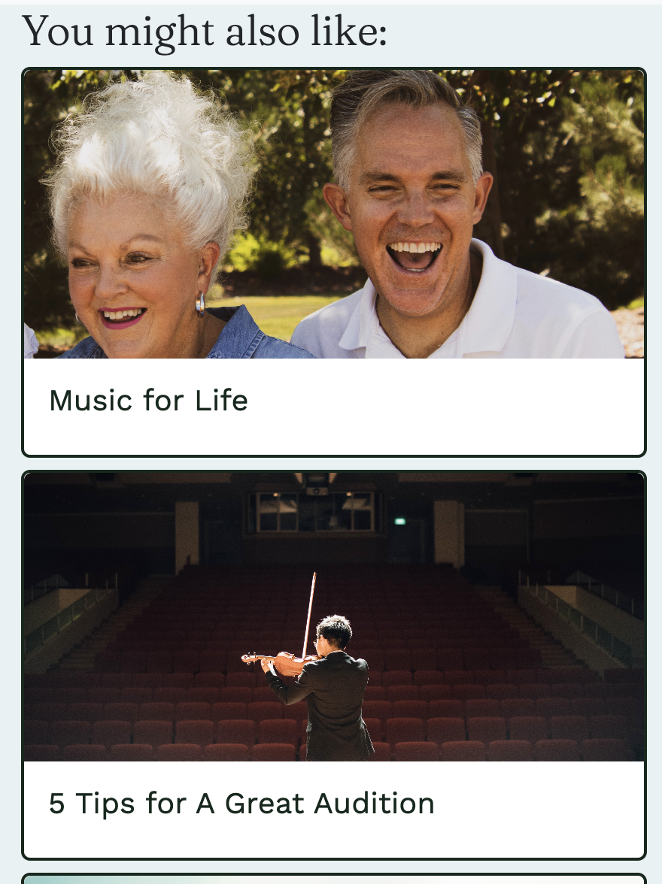

**Add to Favourites**
- Authenticated users can use the Star icon to mark the resource as a favourite. Favourite articles can be accessed directly from the Dashboard.

### Log Practice
Authenticated Users can log a practice session using the form on this page
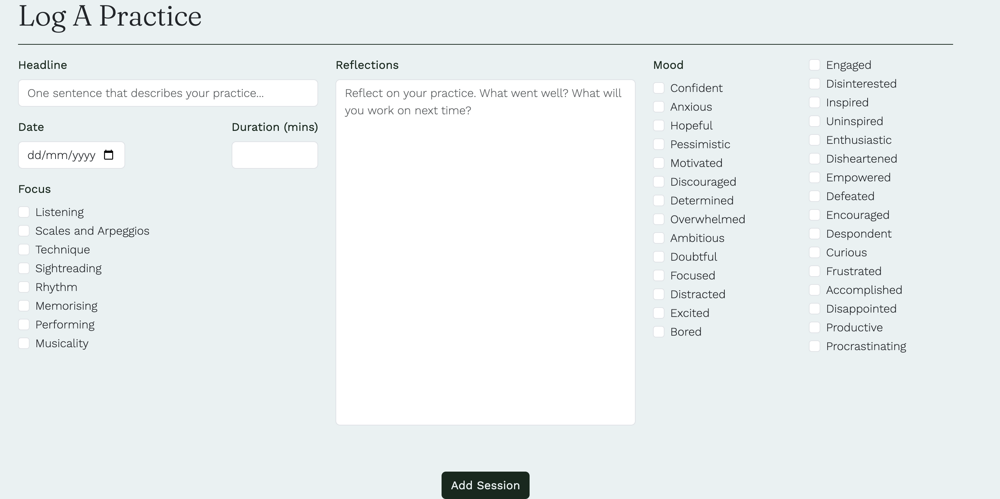

- Custom error messages are rendered if the form is not valid when submitted
- After successful submission, the user is returned to the Dashboard.

### Session Details

Users can view details from a logged practice including the Reflection, Focus and Moods.

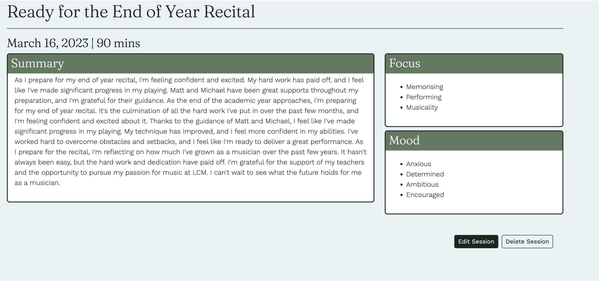

- Users can delete a session by clicking the **Delete Practice** button. A modal is used to confirm the request before removing the session and redirecting the user to the dashboard.

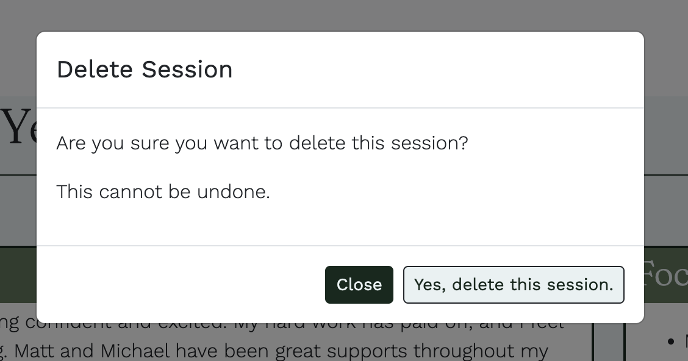

- Users can edit a session by clicking the **Edit Practice** button which redirects them to the [Edit Practice](#edit-practice) page.

### Edit Practice

Users can edit a recorded practice using a prepopulated form.

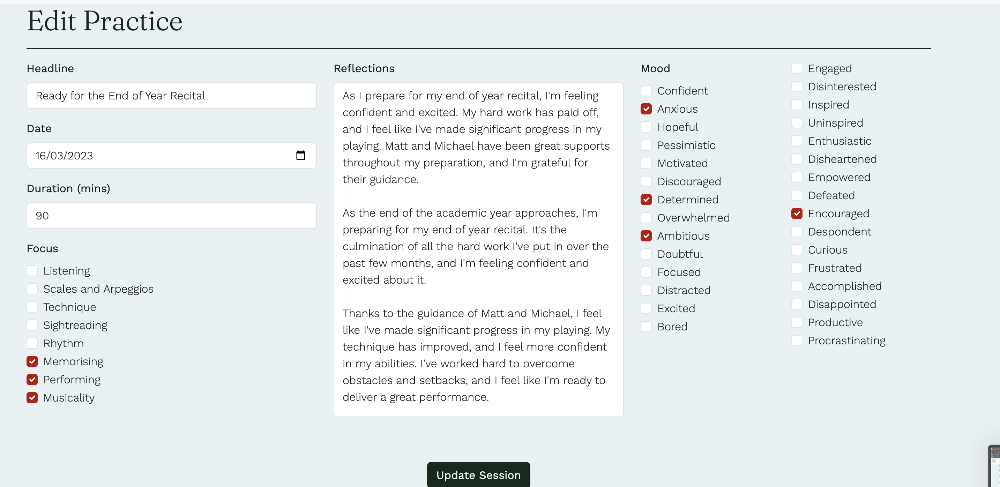

- Changes to the practice are saved by clicking the **Update Practice** button.
- Users are redirected to the [Session Details ](#session-details)  page.
- If the form is invalid, custom error messages are rendered for the user.

### Resource Admin

The administration of the Resources is handled by Django's built-in [Admin Interface.](https://docs.djangoproject.com/en/4.1/ref/contrib/admin/ 'Link to Django Admin Docs') 
- This allows administrators to create, update and delete Resources.
- Resources can be drafted first and published at a later date.
- A placeholder image is provided but uploaded images can be added to each resource.
- The slug is automatically provided from the Resource title.

### 404 Page

If any action triggers a 404 error, the User will be shown a custom 404 page.

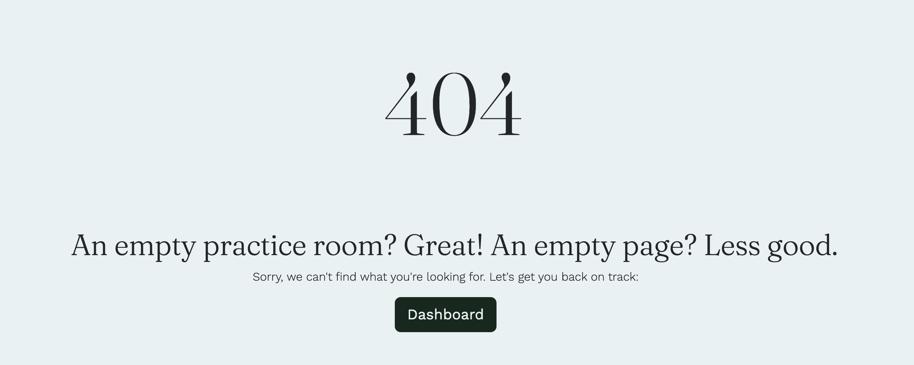

This replaces the template provided by Django. A button returns the user to the Dashboard. Similar templates have been added to handle 400 and 500 errors.

## Planned Features and Improvements

**Errors in Add Goal Modal**

Currently, if a user submits an invalid form to add a goal, they are redirected to the dashboard, where an error message is rendered. In future, the modal will remain open and the error message will be displayed in the modal itself. 

**Alt Text for Cloudinary Images**

The Alt text for images rendered for Resources is often inconsistent. More work is required to ensure that these are used consistently to improve accessibility.

**Spinners and Loaders**

Spinners are used to show that an update or delete request to a user Goal is in progress. Additional spinners will be added to user actions that can occasionally be slow, resulting in double clicks including adding a goal, signing in, registering etc.

**Links to Practice Details from Calendar Widget**

Users will be able to access a practice session directly from the 'Last 30 Days' widget on the Dashboard.

**Reflections Rendering**
Currently the practice sessions 'Reflections' render without formatting. In future, a WYSIWYG editor will be used to allow users to add formatting to these entries.

Users will be able to access a practice session directly from the 'Last 30 Days' widget on the Dashboard.

**Streak Building**

Users will be able to build a streak of consecutive practice days which will be recorded. This is an important aspect of gamifying habit-building.

**Handling Multiple Goals and User Resources**

Currently, if users favourite a large number of resources or add a lot of goals, it will result in an unattractive list on the Dashboard UI. In future, the number of goals will be limited and the My Resources tab will utilise a 'See More' button to hide resources.

## Testing

Rescala has been extensively tested. You can view more about testing, including automated and manual testing, accessibility, validators and more, [here.](documentation/docs/TESTING.md)

## Deployment

The live version of Rescala is deployed on Heroku. Full details and steps to replicate the deployment can be found [here.](documentation/docs/DEPLOYMENT.md)

## Technologies

### Languages

-  **Python**
-   **HTML5**
-  **CSS3**
-  **Javascript**

### Libraries and Frameworks
The following libraries and frameworks were used in the development of this project. The documentation for all libraries and frameworks was used extensively.

- [**Bootstrap**](https://getbootstrap.com/). Various Bootstrap components are used in Rescala including the Cards, Alerts, Navbar, Pagination and, importantly, the Row & Col layout components. Various utility classes are used to add custom styling.
- [**ChartJS**](https://www.chartjs.org/) was used to create the Doughnut chart to represent aggregated Foci on the Dashboard.
- [**Django**](https://django-book.readthedocs.io/en/latest/). This project is built with Django, utilising its many out-of-the-box functions.
- [**Django AllAuth**](https://django-allauth.readthedocs.io/en/latest/) was used to handle the authentication, registration and account management.
- [**Django Cloudinary Storage**](https://pypi.org/project/django-cloudinary-storage/) was used to facilitate integration with Cloundinary.
- [**Django Crispy Forms**](https://django-crispy-forms.readthedocs.io/en/latest/) is used to reinforce DRY principles in the rendering and handling of forms. It is used in this project in conjunction with Bootstrap5 styling.
- [**jQuery**](https://jquery.com/) was used to add interactivity and handle the manipulation of the DOM.
- [**Masonry**](https://masonry.desandro.com/) is used to handle the dynamic rendering of the Dashboard widgets which improves the responsiveness of the UI.
- [**Summernote**](https://github.com/summernote/django-summernote) is used to add WYSIWYG functionality to the Resource model in the Admin panel.

### Hosting and Storage

- [**Cloudinary**](https://cloudinary.com/) is used to store the static files, including Admin-uploaded images.
- [**Heroku**](https://www.heroku.com/) provides the hosting for Rescala.
- [**ElephantSQL**](https://www.elephantsql.com/) is used as the database hosting service for the production version of this project.

### Version Control

-  **Git & GitHub** 
Git and GitHub were used throughout this project to assist with version control and deployment. Please see the [Deployment](#deployment) for more information.

### Design & Media

- [**Balsamiq**](https://balsamiq.com/) was used to create the wireframes.
- [**Coolors**](https://coolors.co/) colour palette generator was used to choose the colour scheme for Rescala.
- [**Google Fonts**](https://fonts.google.com/) As described above, both fonts for this project (Fraunces & Work Sans) are supplied by Google Fonts.
- [**Font Awesome**](https://fontawesome.com/)'s easily recognisable icons are used to make buttons and forms more intuitive.
- [**Unsplash**](https://unsplash.com/) Royalty-free photos were used for the images in the Resources app, including the placeholder image.

### Databases

-  [**SQLite**](https://sqlite.org/index.html) was used for the development database and during unit testing.
-  [**PostgreSQL**](https://www.postgresql.org/), via Elephant SQL, is used for the production database.

### Other
- [**GitHub Wiki TOC Generator**](https://ecotrust-canada.github.io/markdown-toc/) was used to create the table of contents in this document
- [**Quick DBD**](https://www.quickdatabasediagrams.com/) was used to design the database diagrams

## Credits
### Code
The resources below were significantly used in the development and deployment of this project. 
Where code has been used verbatim, it is also credited in the code itself.

- [Highlighting Active Page in Django](https://valerymelou.com/blog/2020-05-04-how-to-highlight-active-links-in-your-django-website)
- [Testing Forms in Django](https://adamj.eu/tech/2020/06/15/how-to-unit-test-a-django-form/)
- [Removing Browser Validation from Crispy Forms](https://stackoverflow.com/questions/63539170/how-to-add-action-and-novalidate-attribute-to-form-tag-using-crispy-form)
- [Integrating Crispy Forms in Django](https://www.youtube.com/watch?v=MZwKoi0wu2Q&t=521s)
- [Integrating Summernote in Django](https://djangocentral.com/integrating-summernote-in-django/)
- [Add ChartJS to Django](https://www.section.io/engineering-education/integrating-chart-js-in-django/)
- [Customizing AllAuth Forms pt.1](https://dev.to/danielfeldroy/customizing-django-allauth-signup-forms-2o1m)
- [Customizing AllAuth Forms pt.2](https://gavinwiener.medium.com/modifying-django-allauth-forms-6eb19e77ef56)
- [Extending the Base User Model](https://simpleisbetterthancomplex.com/tutorial/2016/07/22/how-to-extend-django-user-model.html)
- [W3Schools](https://www.w3schools.com/) was referenced for Python syntax including list comprehension and built-in functions eg. any()
### ChatGPT

[Open AI's ChatGPT ](https://openai.com/blog/chatgpt) was used to accomplish various tasks during this project including:

- writing the practice logs and the resources for this version of Rescala.
- explaining obscure or verbose error messages, particularly during the unit testing phase.
- formatting headings and text used in this ReadMe.
- formatting long lists of tuples for options constants in forms.

### Music Resources
[The Musician's Union Practice Diary](https://musiciansunion.org.uk/working-performing/music-teaching/working-as-a-music-teacher/practice-diaries-and-workbooks) provided inspiration for Rescala

## Acknowledgements
- The Code Institute example read me was used as a template for this document.
- The Code Institute Walkthrough *I Think Therefore I Blog* was used as inspiration for the Resource app. Large sections of the walkthrough were also used to inform the deployment section of this document.
 The support of my mentor Spencer Barriball for his advice, guidance and directions to resources is gratefully acknowledged.