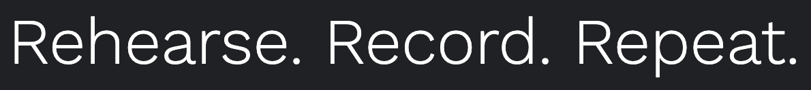

# Rescala
An online practice diary for classical musicians, built with Django.
> Get closer to your musical goals with Rescala.
>
> Rehearse. Record. Repeat.

This project was designed and built as the developer's 4th milestone project for Code Institutes's Diploma in Full Stack Software Development.

Key features:

 - Log and review practice sessions, including date, duration, your areas of focus and personal reflections
 - Set and track long term goals
 - View insights from your practice on a bespoke dashboard
 - Read and save articles focused on intentional practice, habit building and personal development

 ## Live Project
[The deployed site is available here.](https://denham-rescala.herokuapp.com/ "Link to open deployed website")

## User Stories
The User Stories for this project were planned and tracked  using [GitHub's Projects Tool.](https://docs.github.com/en/issues/planning-and-tracking-with-projects/learning-about-projects/about-projects "Link to information on GitHub Projects")

User Stories were categories into Epics and broken down into tasks with clear acceptance criteria. The user stories can be viewd, in full, [here.](https://github.com/users/denham-ed/projects/6 "Link to Rescala User Stories")

Inspired by the Agile methodology and utlising the MoSCoW prioritization, these user stories were assigned to short sprints, as documented on the Projects board. These process allowed for incremental development through iteration.

## Design 
### Wireframes
The layout for Rescala was developed using [Balsamiq](https://balsamiq.com/ "Link to Balsamiq")

The wireframes for Rescala can be found [here.](documentation/diagrams/wireframes.pdf)

### Colour Scheme
Rescala usess the following colours throughout.

The Dark Green and Alice Blue are used as alternatives for black and white. The red is used for error messages and to highlight key information on forms and widgets. The lighter green is used primary for shading and to add additional contrasts.

All four colours are used with varying degrees of opacity to support text/image overlays.
### Typography
Two fonts are used in the application.

**Fraunces** is used for headings and the brand logo in the header. It is used with a font weight of 300.

**Work Sans** is used with a font weight of 300 for the majority of text in the body. Occassionally it appears at 400, to add emphasis for subtitles and for headers.

## Database Model

### Requirements 
- Each user needs a list of goals. These are unique to the user.
- Each user needs a list of resources. This is a many-to-many relationship.

Therefore, the profile model for this application extends the Django User model.

### Models

## Current Features	

### Layout Features

**Header**

- Appears on every page
- Features the Brand logo in the top left

- Includes a navigation bar with links to key areas

- Authenticated users can access the Dashboard, Log Practice and Log Out areas
- Current page is shown to the user
- Anonymous users will only have access to the Resources link

**Footer**

- Appears on every page
- Includes the brand name and slogan

- Includes links the developer's GitHub and LinkedIn page. These open in a new browser tab.

### Landing Page

- Displays the brands slogan
- Features a large Call-To-Action button

### Authentication
The authentication for Rescala is handled by [Django AllAuth.](https://django-allauth.readthedocs.io/en/latest/)

Anonymous (unauthenticated users) can view the landing, sign in and register pages, as well as accessing the Resources section of the site.

The following pages extend and modify the AllAuth templates, adding custom formatting and error messages.
**Register Page**

- New users can register for a Rescala account
- Floating labels provide clear instruction to the user

- Registered users are guided to the sign in page
- Invalid form submissions are indiciated with custom error messages

**Sign In Page**
- Users with accounts can sign in to Rescala
- Floating labels provide clear instruction to the user
- New users are guided to the Register page
- Valid submission redirects to the Dashboard
- Invalid form submissions are indiciated with custom error messages
- Users can opt for the Remember Me option to by pass this stage next time

**Sign Out Page**

 - Users are asked to confirm that they are logging out
 - The confirmation options are in-keeping with the tone for the target user

### Dashboard

**Recent Practices**
**Goals**
**Moods**
**Calendar**
**Focus**
**Total Practice**
**User Resources**

## Planned Features

## Testing
### Accessibility 
### Validators
### Manual Testing
### Automated Testing
### Responsiveness

## Deployment

## Technologies

### Languages

 - **Python**
 - **Javascript**
 - **HTML5**
 - **CSS3**

### Libraries and Frameworks

 - **Django**
 - **Django AllAuth**
 - **jQuery**
 - **Bootstrap**
 - **Django Crispy Forms**
 - **Summernote**

### Hosting and Storage
 - **Cloudinary**
 - **Heroku**
 - **ElephantSQL**

### Version Control
- **Git**
- **GitHub** 

### Design & Media
- **Coolors**
- **Google Fonts**
- **Font Awesome**
- **Unsplash**
- **Canva**

### Databases
 - **SQLite** was used for the development database and during unit testing
 - **PostgreSQL**, via Elephant SQL, is used for the production database.
### Credits
### Chat GPT

## Acknowledgements