# Rescala - Testing

## Automated Testing
Rescala includes a suite of 61 automated tests using Django's unittest library.
These cover all aspects of views, models and forms. Tests can be found in the relevant app's folders in the format *tests-*.*py*

The functionality provided by AllAuth has not been tested in this way, but has undergone manual testing. However, the custom Register and Sign In forms have been tested in this suite.

All tests pass successfuly, as shown below.

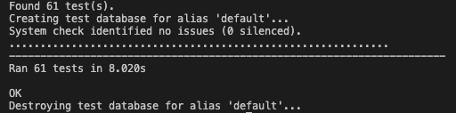

## Manual Testing

### General
|User Action  | Expected Result  | Pass / Fail |
|--|--|--|
|Navigate to page that doesn't exists  | 404 page is rendered  | Pass |

### Header

|User Action  | Expected Result  | Pass / Fail |
|--|--|--|
| Click R logo | Redirects to Landing Page (unauthenticated) or Dashboard (authenticated)  | Pass |
|Click Sign In | Redirects to Sign In Page  | Pass|
|Click Register  | Redirects to Register Page  | Pass |
|Click Resources | Redirects to Resources Page  | Pass |
|Click Log Practice | Redirects to Log Practice Page |Pass |
|Click Dashboard | Redirects to Dashboard Page  |Pass |

### Footer

|User Action  | Expected Result  | Pass / Fail |
|--|--|--|
|Click GitHub logo | Opens new tab and directs to developer's GitHub page  | Pass |
|Click LinkedIn logo | Opens new tab and directs to developer's Linked page | Pass |

### Landing Page

|User Action  | Expected Result  | Pass / Fail |
|--|--|--|
|Click 'Try Rescala Now' button | Redirects to Register Page  |Pass |

### Sign In Page

|User Action  | Expected Result  | Pass / Fail |
|--|--|--|
|Enter Text Into Input | Floating labels shrink  | Pass |
|Enter Text Into Password Input | Password is obfuscated  | Pass |
|Click Sign In Button with Incomplete Form | Error message(s) appear on form |Pass |
|Click Register Now Button  | Redirects to Register page  |Pass |
| Incorrect Password/Username are submitted  | Error message is rendered  | Pass |
|Correct Passwork & Username  | User is authenticated. Redirects to Dashboard  |Pass |

### Dashboard

|User Action  | Expected Result  | Pass / Fail |
|--|--|--|
|Click on Session in Recent Practice  | Redirects to Session Details Page  | Pass |
|Click on Resource in My Resources  | Redirects to Resource Page | Pass |
|Resize Browser Window  | Widgets optimize masonry layout  | Pass** |
|Hover on circle in Last 30 Days widget | Tool tip shows date | Pass |

** Occassionally on the initial load the Focus chart is overlapping. This is due to the image loading after the layout is complete and needs further investigation.

### My Goals

|User Action  | Expected Result  | Pass / Fail |
|--|--|--|
|Click Add Goal Button  | Modal, with Add Goal Form, opens  |Pass |
|Submit Blank String in the Add Goal Form  | Redirects to Dashboard, renders Error  | Pass |
|Submit Valid Goal  | New Goal is rendered to Dashboard with an empty progress bar  | Pass |
|Click 'X' Button  | Hide Edit Button, Reveal Trash Can Button and Check Button  | Pass |
|Click 'Trash Can' Button  | Removes Goal, redirects to Dashboard, renders confirmation message  |Pass |
|Click 'X' Button, then Check Button  | Return to unchanged Dashboard  | Pass |
|Click 'Pencil' Button  | Hide 'X' Button, Reveal 'Check Button', Reveal Range Input| Pass |
| Click 'Pencil' Button then Check '  |Reveals Spinner, Updates Goal progress, rerenders Dashboard with updated Goal. Renders confirmation message.  |Pass |

### Log Practice

|User Action  | Expected Result  | Pass / Fail |
|--|--|--|
| Submit form with missing required field (Headline, Date, Duration, Reflections)  | Error messages rendered to form  | Pass |
| Submit form with required fields  | Redirects to Dashboard - logged practice is visible on Dashboard. Widgets update with new minute tally and adjusted focus and moods.  | Pass |
|Submit form with no Focus and/or Mood  | Form submits  | Pass |

### View Practice

|User Action  | Expected Result  | Pass / Fail |
|--|--|--|
| User loads page | Correct session is rendered. Moods and Focus, if present, are displayed  | Pass |
|Click Edit Practice Button  | Redirects to Edit Practice Page  | Pass |
|Click Delete Practice Button  | Opens Delete Practice Modal  | Pass |
|Click Close Button in Modal  | Closes Modal  | Pass |
|Confirm Delete Pracitce  | Redirects to Dashboard. Practice is no longer visible on Dashboard  | Pass |

### Edit Practice

|User Action  | Expected Result  | Pass / Fail |
|--|--|--|
| User loads page | Edit Practice form is populated with session  | Pass |
| Submit form with missing required field (Headline, Date, Duration, Reflections)  | Error messages rendered to form  | Pass |
| Submit valid form  | Redirects to View Practice Page. Success message renderes  | Pass |

### Resources

|User Action  | Expected Result  | Pass / Fail |
|--|--|--|
|Hovers on image  | Excerpt overlay displays  | Pass |
|Clicks card  | Redirects to Resource page  | Pass |
| Clicks pagination control  | Redirects forwards or backwards  | Pass |

### Resource

|User Action  | Expected Result  | Pass / Fail |
|--|--|--|
| Authenticated user clicks empty star  | Resource is added to Profile, success message renders  | Pass |
| Authenticated user clicks empty star  | Resource is removed from Profile, success message renders  | Pass |
| Click card recommended card | Redirects to Resource page  | Pass |

### Logout

|User Action  | Expected Result  | Pass / Fail |
|--|--|--|
|Click 'No' Button  |Redirects to Dashboard  | Pass |
|Click 'Yes' button  |Logs user out, redirects to Landing Page  | Pass |

## Bugs

## Validators

### HTML
The HTML for this project is generated by the Django template language. 
The generated HTML for each page was validated by [W3C Markup Validation Service.](https://validator.w3.org/ 'Link to W3C Validator') 

No errors or warnings were raised during this testing.

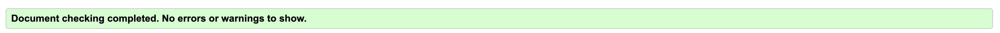

### Javascript

[ESLint](https://eslint.org/ 'Link to ESLint') was used to validate the Javascript in this project, with the following results.

**script.js** - Generic JS for the whole site
|Flagged Issue| Notes  |
|--|--|
|'bootstrap' is not defined  |bootstrap is defined in a preceding script  |

**dashboard-scripts.js** - JS for Dashboard features
|Flagged Issue| Notes  |
|--|--|
| 'Chart' is not defined | Chart is defined in a preceding script as it is part of the ChartJS package  |

### CSS3

[W3C CSS Validation Service](https://jigsaw.w3.org/css-validator/ 'Link to W3C CSS') was used to validate the CSS3 in this project. **No errors were found**.

### Python / PEP8 
The Python in this project is written to PEP8 standards to ensure readability and maintainability.
All code written by the developer was checked [Code Institute Python Linter ](https://pep8ci.herokuapp.com/ 'Link to Code Institute Python Linter'). **No errors or warnings were found.**

## Lighthouse

The following reports for each page were generated by  [Lighthouse](https://developer.chrome.com/docs/lighthouse/overview/#:~:text=Lighthouse%20is%20an%20open-source,apps,%20SEO,%20and%20more. 'Link to Lighthouse docs'), and open-source tool for improving the quality of web pages.

On the whole, high scores were obtained; see below for more information and planned improvements.

**Notes:**
- An issue with Cloudinary (used for image and static storage) is being logged to the Issues tab in the browser DevTools. This requires further investigation.
- Lighthouse flags the use of JS libraries with known security vulnerabilities (jQuery and Bootstrap)
- Accessibility could be improved on some pages by using the semantic Heading tags in order. This has been noted for future updates and projects.
- The loading of images creates a noticeable dip in performance. Admin users should be aware of this when selecting images for the Resources.

**Landing**

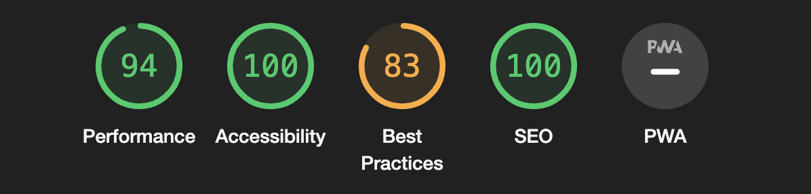

**Register**

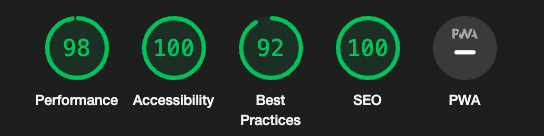

**Log in**

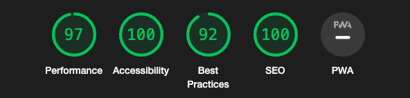

**Dashboard**

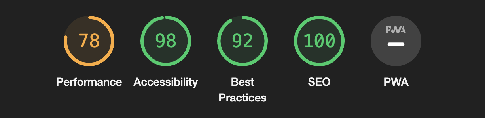

**Log Practice**

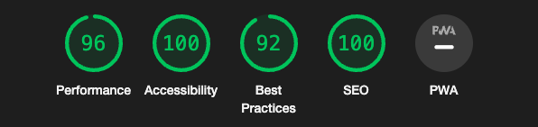

**Practice Details** 

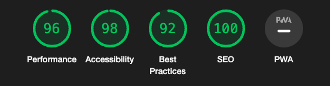

**Update Practice** 

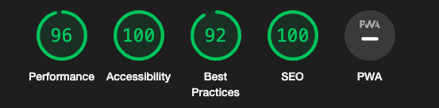

**Resources**  

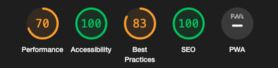

**Resource**

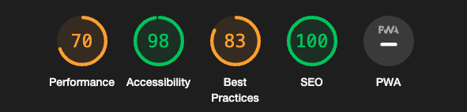

## Accessibility

## Accessibility

Accessibility was tested using the [WAVE Web Accessibility Evalutation Tools](https://wave.webaim.org/) Chrome extension. Overall the results were very positive, as shown by the screenshots, below. However, the following feedback has been noted for future updates to improve accessibility for all users:

- Update forms (Log and Update Practice) to include fieldsets to bind the checkboxes more closely with the labels
- Add an alternative to Device Dependent Event Handlers such as the 'click' required for to favourite / un-favourite a Resource.
- Investigate alt descriptions and captions for images stored on Cloudinary and rendered dynamically.

NB. There are 5 contrast errors flagged on the register page. These refer to html generated by the Crispy Forms layout and need further investigation.

### WAVE Reports

**Landing**

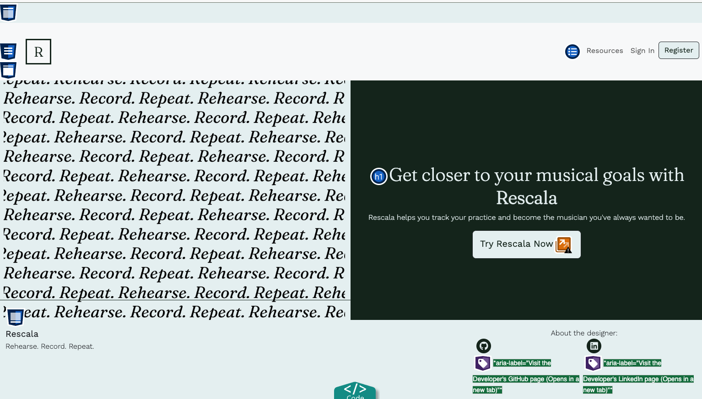  

**Register**  

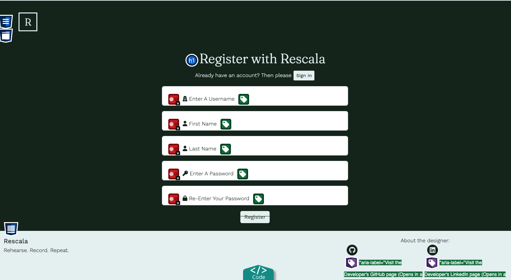 

**Sign In**  

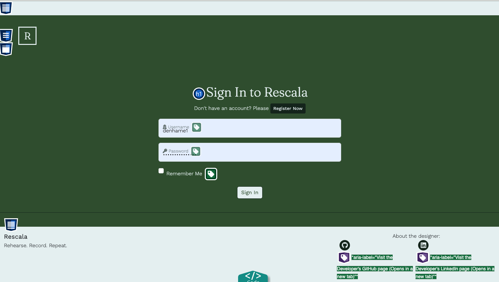 
**Dashboard**  
**Log Practice**  
**Update Practice**  
**Practice Details**  
**Resources**  
**Resource**

## Responsiveness
## Bugs

